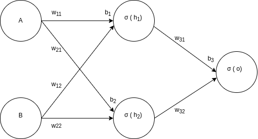
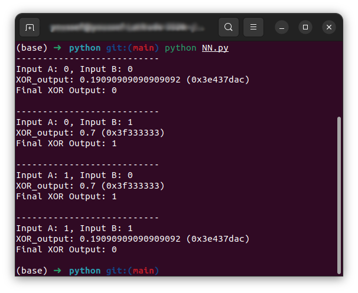
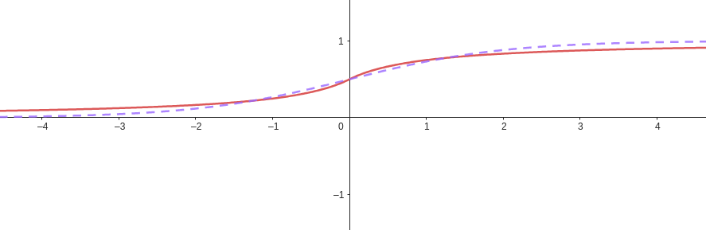
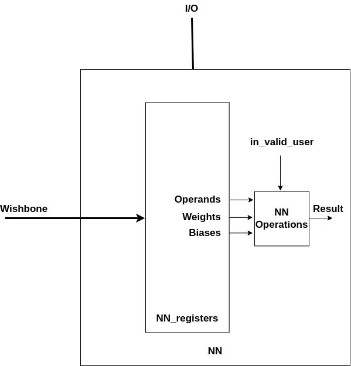
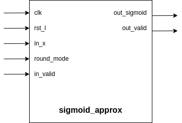
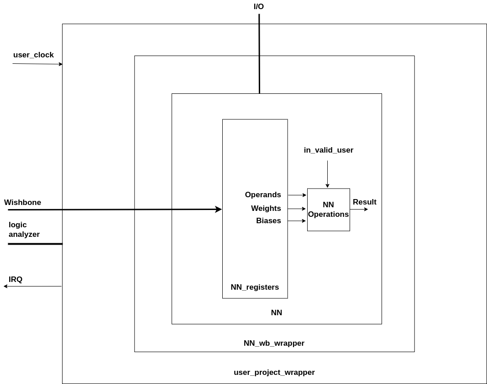

# Neural Network Accelerator using SystemVerilog

(Integration with Efabless Caravel chip)

Figure 1: Neural Network Architecture to be implemented 

# Introduction

### XOR Problem

The XOR problem refers to the inability of single-layer perceptrons to solve non-linearly separable functions, like XOR, highlighting the limitations of early neural networks. This issue contributed to skepticism about AI's potential, fueling the AI Winter in the 1970s. The XOR problem's resolution demonstrated the necessity of non-linear activation functions and multi-layer architectures, foundational for modern AI's success.

Figure 1 displays a simple neural network with 2-neuron hidden layer and  sigmoid activation functions that solves the XOR Problem.

# Mathematical Model

%5C%5C%5Csigma(h_2)%5Cend%7Bbmatrix%7D) (EQ1)

%5C%5C%5Csigma(h_2)%5Cend%7Bbmatrix%7D%2Bb_3)

+w_{32}\sigma(h_2)+b_3)

) (EQ2)

Figure 2: Mathematical operations of NN in figure 1

### XOR Truth Table and Values Table

<table>
  <caption>XOR Truth Table</caption>
  <thead>
    <tr>
      <th>A</th>
      <th>B</th>
      <th>O'</th>
      <th>Y</th>
    </tr>
  </thead>
  <tbody>
    <tr>
      <td>1</td>
      <td>1</td>
      <td>&lt; 0.5</td>
      <td>0</td>
    </tr>
    <tr>
      <td>0</td>
      <td>1</td>
      <td>&gt; 0.5</td>
      <td>1</td>
    </tr>
    <tr>
      <td>1</td>
      <td>0</td>
      <td>&gt; 0.5</td>
      <td>1</td>
    </tr>
    <tr>
      <td>0</td>
      <td>0</td>
      <td>&lt; 0.5</td>
      <td>0</td>
    </tr>
  </tbody>
</table>

<table>
  <caption>Values to Achieve the Truth Table</caption>
  <thead>
    <tr>
      <th>var</th>
      <th>value</th>
      <th>var</th>
      <th>value</th>
      <th>var</th>
      <th>value</th>
    </tr>
  </thead>
  <tbody>
    <tr>
      <td>w11</td>
      <td>4</td>
      <td>w22</td>
      <td>-4</td>
      <td>b1</td>
      <td>-2</td>
    </tr>
    <tr>
      <td>w12</td>
      <td>4</td>
      <td>w31</td>
      <td>4</td>
      <td>b2</td>
      <td>6</td>
    </tr>
    <tr>
      <td>w21</td>
      <td>-4</td>
      <td>w32</td>
      <td>4</td>
      <td>b3</td>
      <td>-6</td>
    </tr>
  </tbody>
</table>

**Verification**: run a python script that uses those values  `NN.py` inside the python folder.

# Verilog Implementation

### Testing & verification

To test the Verilog implementation, navigate to **repo/verilog/cocotb**  and write command `make.` This will run a testbench with the aforementioned weights on the four test cases for `A` and `B`, and print the results which successfully match those obtained from the python script.

![][image10]  
Figure 3: results from cocotb test for the NN module

**Note**: This test runs on commit \*\*\*. The cocotb test is currently invalid. Instead, use the following commands in `repo/verilog/tb`:

1. `iverilog -g2012 -I../rtl NN_tb.sv -Wall -o NN_tb`  
2. `vvp NN_tb`"

![][image11]

### Number format

The SystemVerilog NN module handles **IEEE 754 single-precision floating point** numbers.  
For example, the conversion of hexadecimal representation to decimal representation for numbers in figure 3 is as follows

| Hex | Dec |
| :---: | :---: |
| 0x3f800000 | 1.0 |
| 0x3e437dac | 0.19090909 |
| 0x3f333334 | 0.70000005 |

### Sigmoid Function

To make synthesizable SystemVerilog code and overcome the issue of the exponent in the Sigmoid Function  I used the following approximation =\begin%7Bcases%7D1-0.5(1%2B\frac%7B-x%7D%7B1-x%7D),%20%26%20x%3C0%20%5C%5C%200.5(1%2B\frac%7Bx%7D%7B1%2Bx%7D),%20%26%20x%5Cgeq0%20\end%7Bcases%7D).

Figure 4: Sigmoid function approximation shown in solid red; sigmoid function shown in dotted purple.  
To implement `sigmoid_approx` module in SystemVerilog I utilized the following modules:

- `add_sub`  
- `multiplier`   
- `divider` 

### Floating Point Unit

I used [Lampro-Mellon/Caravel\_FPU](https://github.com/Lampro-Mellon/Caravel_FPU/tree/main) which is fully compliant with the IEEE-754 standard. Specifically I used the following modules

- `add_sub`  
- `multiplier`   
- `divider` 

### Matrix Multiplication

To utilize parallelism in hardware, I designed two custom matrix multiplication units to perform EQ 1 and EQ 2 from Figure 2\.

- `matrix_multiply_1x2_2x1`  
- `matrix_multiply_2x2_2x1` 

### Top Module

Top Module is `NN` in  `NN.sv` that implements the mathematical model in figure 2 utilizing the following set of modules

- `add_sub`  
- `multiplier`   
- `divider`   
- `matrix_multiply_1x2_2x1`  
- `matrix_multiply_2x2_2x1`   
- `sigmoid_approx`

Figure 5: NN module diagram

In figure 5 For Neural Network calculations to be performed the NN module depends on NN registers for storing weights and biases and provision of NN inputs (A and B) that are affected by read/write instructions via the wishbone. Only when `in_valid_user` is set to high will the NN Operations commence and the result will be calculated by a forward pass.  

### sigmoid\_approx Module

Figure 6: Sigmoid Module Diagram

|In figure 6 `out_valid` is a flag that indicates the readiness of the result at the `out_sigmoid` signal. It takes on average about 26 cycles for the result to be ready as this module depends on the `divider` module for which you can find more information in [Lampro-Mellon/Caravel\_FPU](https://github.com/Lampro-Mellon/Caravel_FPU/tree/main).

# Caravel Chip Integration

### Integration of NN as Memory Mapped Peripheral

`A NN` has a specific address range in memory that the core writes data to and reads data from. NN is integrated with the core using the Wishbone interface. The core acts as a master while IP acts as a slave. Write instructions are used at the beginning to write values of weights, biases, and inputs into the IP using the write control signals, then the IP sets acknowledge ack indicating that operation is completed. The unit is controlled via a set of registers.

`NN` range memory is illustrated in the following table

| CSR | Access Type | offset |
| :---- | :---- | :---- |
| A | Read/Write | 0x00 |
| B | Read/Write | 0x04 |
| w11 | Read | 0x08 |
| w12 | Read | 0x0C |
| w21 | Read | 0x10 |
| w22 | Read | 0x18 |
| w31 | Read | 0x1C |
| w32 | Read | 0x20 |
| b1 | Read | 0x24 |
| b2 | Read | 0x28 |
| b3 | Read | 0x2C |

Table 1

All the registers are located in the user design space with the [base address of 0x3000\_0000](https://caravel-harness.readthedocs.io/en/latest/memory-mapped-io-summary.html) \+ the offset described in table 1\.  

Figure 7: Hierarchy that illustrates how the NN top module is integrated into Caravel User Space via user\_project\_wrapper.

# Flow of instructions

To perform a forward pass the following steps are required: 1\. Write each operand with a store instruction to the core. 2\. Once the operation is completed it can be accessed by the core on the GPIO pins.

Figure 8: Flow of instructions

